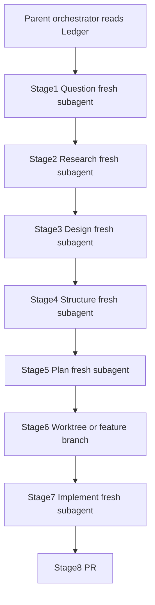

# Shadow AI Guardrail Gateway — Architecture & Roadmap

> ## THE LEDGER IS LAW
>
> This file is the **single source of truth** and the **binding constitution** for every
> agent, subagent, reviewer, and human working in this repository.
>
> - If an instruction conflicts with The Ledger, **The Ledger wins**.
> - If a model wants to "just quickly implement," **stop** and follow QRSPI + guardrails.
> - If a Human Hands-On checkpoint is open, agents **must not** fill it.
> - Read this file **before** any developmental cycle. Keep phase/checkpoint status current.

**Last updated:** 2026-07-22  
**Current phase:** Phase 1 — Crawl (Asynchronous Proxy Setup)  
**Checkpoint status:** `blocked_on_human` — Checkpoint #1 (`app/proxy/interceptor.py`)  
**Pre-merge gate:** AI Governance Engine (Steps 1–7) — `in_progress` (required check on `main`)
**Task workflow:** **QRSPI is mandatory** — see §5 and [`.cursor/qrspi/`](.cursor/qrspi/)
**Product posture:** Open-source gateway + paid dashboard; Doppler secrets; BYOK upstream keys; hosting TBD — see §12.9
**Discipline track:** NASA/JPL **Power of Ten** dual implementations — see §13 (human-owned; agents scaffold only)

---

## 0. Pre-Merge Gate — AI Governance Engine (Steps 1–7)

> **Why this exists:** Vercel + Bugbot alone do **not** enforce AST structure, OWASP patterns,
> fuzzing, Big-O, copyright, or that **you understand the change**. This suite is the merge gate.

### What ships the gate

| Piece | Path | Role |
|-------|------|------|
| Steps 1–6 CLI | `governance/` | Local + CI analysis suite (`ai-guardrail`) |
| CI workflow | `.github/workflows/ai-guardrail.yml` | Runs on every PR → `main` (check name: **Governance Steps 1–6**) |
| Step 6 Comprehension | `governance/.../comprehension_gate.py` | Beginner study guide + quiz |
| Step 7 dashboard | `dashboard/` | Human quiz + Approve/Merge via GitHub API |
| Signature DB | `governance/governance/signatures/known_snippets.json` | Copyright fingerprints |

### The seven steps

| # | Name | Blocks merge? |
|---|------|---------------|
| 1 | AST Guardrail | Yes (error/critical) — **in Actions** |
| 2 | Security Auditor | Yes (error/critical) — **in Actions** |
| 3 | Fuzz Chamber | Yes (crashes) — **in Actions** |
| 4 | Benchmark Engine | Informational — **in Actions** |
| 5 | Copyright Filter | Yes (high similarity) — **in Actions** |
| 6 | **Comprehension Gate** | Quiz **generated** in Actions; **human pass (≥80%) on dashboard / local CLI** before Approve & Merge |
| 7 | Human Review Panel | Dashboard approve/merge (after quiz) |

### How Step 6 (comprehension) is tracked

**GitHub Actions does not grade you.** The `Governance Steps 1–6` check:

1. Runs automated analysis (Steps 1–5)
2. **Generates** the study guide + quiz for this PR’s diff (Step 6)
3. Comments the report on the PR
4. Goes ✅ green if generation succeeded and there are no blocking findings

**You prove understanding separately:**

| Where | Command / action |
|-------|------------------|
| Local practice | `cd governance && ai-guardrail quiz --root .. --skip-llm` |
| Dashboard (Step 7) | Deploy `dashboard/`, open it after CI POSTs the report → read guide → submit quiz (≥80%) → Approve & Merge unlocks |
| GitHub check **`Governance Quiz`** | CI sets **pending**; dashboard sets **success** after ≥80% — require this under branch protection |

Until the dashboard is deployed (`GOVERNANCE_DASHBOARD_URL` + secrets), practice with the local `quiz` command. Branch protection should require both **`Governance Steps 1–6`** and **`Governance Quiz`**.

### Agent preflight (before coding)

1. Read this Ledger (§§0–2, §5, §8 at minimum).
2. Read [`.cursor/qrspi/README.md`](.cursor/qrspi/README.md), [`AUTONOMOUS_MODE.md`](.cursor/qrspi/AUTONOMOUS_MODE.md), [`CONTEXT_ISOLATION.md`](.cursor/qrspi/CONTEXT_ISOLATION.md).
3. Run **QRSPI** with **fresh subagents per stage** and file allowlists.
4. Never complete `TODO: Human Hands-On Implementation` blocks.
### Required human setup (for the gate to actually protect `main`)

See **§11 Setup Checklist** below. Require status checks:

- **`Governance Steps 1–6`**
- **`Governance Quiz`** (dashboard flips pending → success after ≥80%)
- **`Enterprise Layers B–E`** (Dependabot/gitleaks/ruff/mypy/semgrep/tests/trivy/checkov — see [`ENTERPRISE_LAYERS.md`](ENTERPRISE_LAYERS.md))
- **`CodeQL (Layer C)`** after it appears once

Protect Main ruleset should include **`Governance Quiz`** once it has appeared on a PR (GitHub only lists checks that have run at least once). Remaining operator steps (secret push protection, signed commits, second reviewer, etc.) are listed in [`ENTERPRISE_LAYERS.md`](ENTERPRISE_LAYERS.md).

---

## 0b. Enterprise Layers B–E (additive)

| Layer | Focus | Automations in repo |
|-------|-------|---------------------|
| B | Supply chain & secrets | Dependabot, checksummed Gitleaks, pip-audit, npm audit (high+ hard-fail) |
| C | Static analysis | Ruff, Mypy, Semgrep (custom + ERROR packs), CodeQL Advanced (`codeql.yml`, security-extended upload), CODEOWNERS |
| D | Product tests | API integration tests, egress/audit contracts, coverage ≥60% |
| E | Ship & runtime | `EgressCheckedAsyncClient`, audit DDL, non-root Docker→Trivy CRITICAL+HIGH + SBOM, Terraform+Checkov |

Details: [`ENTERPRISE_LAYERS.md`](ENTERPRISE_LAYERS.md).

---

## 1. Executive Context

We are building an **enterprise security proxy** that sits between corporate users and public LLMs (OpenAI / Anthropic) to prevent data leaks **pre-flight**. The gateway:

1. Intercepts outbound LLM traffic before it leaves the private network
2. Sanitizes prompts (Phase 2+) and enforces access rules
3. Tracks token consumption, errors, and risk metrics (Phase 3+)
4. Logs audit trails for compliance and operational risk management
5. Runs as a long-lived async service (Docker on Fly.io / Render / later AWS ECS) — **not** on Vercel serverless (streaming timeout risk)

### Human-in-the-Loop & Resume Constraint

This is a 12-month portfolio project. AI agents do ~90% of boilerplate and heavy lifting. The human Engineering Manager **must hands-on engineer the core logic of each pillar at least once or twice**, so every architectural choice and operational mechanism is resume-defensible.

By project end, the human must truthfully claim:

1. **Developed an asynchronous enterprise API proxy** handling outbound LLM traffic, reducing data-exposure risks by intercepting prompts pre-flight.
2. **Engineered a localized Python data-scrubbing pipeline** using NLP tokenization to automatically redact PII with sub-100ms latency.
3. **Integrated a PostgreSQL database layer** to securely track token consumption metrics, error tracking, and risk-management audit trails.
4. **Packaged application using Docker** and built infrastructure-as-code (Terraform) deployment pipelines to securely host the gateway within a private cloud network.

---

## 2. Agent Hierarchy (Chain of Command)

| Role | Model | When to invoke |
|------|-------|----------------|
| **THE BRAIN** | Opus 4.8 | Extremely sparingly. High-level architectural impasses only. Do **not** invoke unless explicitly told. |
| **SENIOR ENGINEER** | Grok 4.5 | Architect, workflow designer, reviewer. Directs building; not the primary bulk code doer. |
| **THE DOER / ACHIEVER** | Composer 2.5 / Auto 2.5 | Bulk file generation, boilerplate, configurations, baseline tests, refactoring. |
| **THE SECURITY CHIEF** | GPT-5.6 Sol | Extreme edge cases only: data scrubbing perfection, pre-flight tokenization, cryptographic verification, exhaustive security test coverage. |

**Default cycle:** Ledger preflight → QRSPI (isolated subagents, autonomous answers) → Composer implements plan → Grok reviews → Human fills product checkpoints → governance validation.

> QRSPI autonomy does **not** override Human Hands-On product checkpoints.

---

## 3. Four-Phase Timeline & Progression Audit

Status vocabulary: `not_started` | `in_progress` | `blocked_on_human` | `complete`

### Phase 1: The Crawl Phase (Months 1–3) — Asynchronous Proxy Setup

| Field | Value |
|-------|-------|
| **Status** | `in_progress` |
| **Checkpoint status** | `blocked_on_human` |
| **Checkpoint file** | `app/proxy/interceptor.py` |
| **Owner (checkpoint)** | Human |

**What we build:** A FastAPI Python service that accepts a text prompt, forwards it asynchronously to OpenAI or Anthropic, handles streaming responses, and passes the answer back.

**What the human learns:** Web requests, `async`/`await`, API routing, HTTP status codes, environment variables.

**Power of Ten spots (see §13):** message-list validation loop (Rules 1–2, 4–5, 7); correlation/header parse with explicit parameter checks (Rules 6–7).

**Human checkpoint:** Intercepting the raw outbound client request payload **pre-flight** — implement `intercept_outbound_request(...)` before any upstream provider call.

**Phase 1 technical contract:**

| Item | Spec |
|------|------|
| Runtime | Python 3.12 |
| Framework | FastAPI + Uvicorn |
| HTTP client | `httpx` (async streaming) |
| Config | `pydantic-settings` via env |
| Health | `GET /health` |
| Proxy | `POST /v1/chat/completions` (stream + non-stream) |
| Providers | OpenAI + Anthropic (request or env default) |
| Hosting stubs | `Dockerfile`, `fly.toml`, `render.yaml`, `docker-compose.yml` |
| Out of scope | Scrubbing (Phase 2), DB (Phase 3), Terraform/AWS (Phase 4) |

**Env vars (Phase 1):**

- `OPENAI_API_KEY` — OpenAI upstream key
- `ANTHROPIC_API_KEY` — Anthropic upstream key
- `DEFAULT_PROVIDER` — `openai` \| `anthropic` (default: `openai`)
- `GATEWAY_HOST` / `GATEWAY_PORT` — bind address (default `0.0.0.0:8000`)
- `LOG_LEVEL` — logging verbosity

---

### Phase 2: The Walk Phase (Months 4–6) — Local AI & Data Manipulation

| Field | Value |
|-------|-------|
| **Status** | `not_started` |
| **Checkpoint status** | `not_started` |
| **Checkpoint file** | TBD — core string substitution / regex-NLP scrubbing loop |
| **Owner (checkpoint)** | Human |

**What we build:** Pre-forward inspection: string flags (API keys, credit cards) + lightweight local NLP (spaCy or high-performance regex) to redact names/corporate terms as tokens like `[REDACTED_NAME]`. **Latency budget: sub-100ms.**

**What the human learns:** Data scrubbing, string manipulation, tokenization, local text pipelines.

**Power of Ten spots (see §13):** bounded scrub/redaction loop over prompt text (Rules 1–5); fixed-capacity findings buffer as the Rule 3 analogue (no unbounded growth on the hot path); tiny pure helpers ≤60 lines (Rule 4).

**Human checkpoint:** The core string substitution / regex-NLP scrubbing array loop.

---

### Phase 3: The Run Phase (Months 7–9) — Database & Audit Logs

| Field | Value |
|-------|-------|
| **Status** | `not_started` |
| **Checkpoint status** | `not_started` |
| **Checkpoint file** | TBD — SQL/ORM insert + analytics schema |
| **Owner (checkpoint)** | Human |

**What we build:** Supabase PostgreSQL. On every employee prompt, asynchronously log timestamp, user ID, token counts, and whether sensitive data leaks were intercepted.

**What the human learns:** SQL schemas, async connection pooling, data relationships, operational risk metrics.

**Power of Ten spots (see §13):** insert helper that checks every return / rowcount and asserts schema invariants (Rules 5, 7); no recursive tree-walk of nested JSON audit payloads (Rule 1); bounded batch flush loops (Rule 2).

**Human checkpoint:** Writing the raw SQL or ORM model insertion statement and constructing the analytics schema.

---

### Phase 4: The Cloud Phase (Months 10–12) — Infrastructure & DevOps

| Field | Value |
|-------|-------|
| **Status** | `not_started` |
| **Checkpoint status** | `not_started` |
| **Checkpoint file** | TBD — core `Dockerfile` polish + Terraform `main.tf` resources |
| **Owner (checkpoint)** | Human |

**What we build:** Production `Dockerfile` packaging + Terraform (`main.tf`) modeling the container in an AWS ECS / VPC private cloud network. (Phase 1 already ships staging stubs for Fly/Render.)

**What the human learns:** Containerization, cloud networking, private subnets, infrastructure-as-code.

**Power of Ten spots (see §13):** keep Terraform/resource helpers short and assertion-dense where we generate config in Python (Rules 4–5); treat `Dockerfile`/`main.tf` as “simple control flow” documents — no clever nested conditionals (Rule 1 analogue). Primary P10 dual-coding remains in Python modules; IaC is discipline practice, not a second language tax.

**Human checkpoint:** Writing the core `Dockerfile` build instructions and defining the basic Terraform resources block.

---

## 4. Progression Audit Table

| Phase | Name | Checkpoint file | Checkpoint owner | Phase status | Checkpoint status |
|-------|------|-----------------|------------------|--------------|-------------------|
| 1 | Crawl — Async Proxy | `app/proxy/interceptor.py` | Human | `in_progress` | `blocked_on_human` |
| 2 | Walk — Scrubbing | TBD | Human | `not_started` | `not_started` |
| 3 | Run — Postgres Audit | TBD | Human | `not_started` | `not_started` |
| 4 | Cloud — Docker + Terraform | TBD | Human | `not_started` | `not_started` |

---

## 5. Operational Protocol — QRSPI Is Mandatory

### 5.1 Default developmental cycle

1. **Preflight** — Read The Ledger + `.cursor/qrspi/*` (§0).
2. **QRSPI** — Run stages 1→8 via isolated subagents (details below).
3. **Human product checkpoint** — If the work touches a `TODO: Human Hands-On Implementation` block, stop there; do not auto-complete it. Inject/keep cheat sheets.
4. **Governance** — Run `ai-guardrail` locally; CI must stay green; pass comprehension quiz before dashboard merge.
5. **Validation** — After human fills a checkpoint, run tests / latency / security checks as required by phase.

### 5.2 QRSPI workflow (law)

Canonical playbooks: [`.cursor/qrspi/`](.cursor/qrspi/)

| Stage | Playbook | Writes | Subagent inputs (ONLY) |
|-------|----------|--------|-------------------------|
| 1 Question | `1_question.md` | `task.md`, `questions.md` | Task / ticket + Ledger |
| 2 Research | `2_research.md` | `research.md` | **`questions.md` only** (never `task.md`) |
| 3 Design | `3_design.md` | `design.md` | `task.md`, `questions.md`, `research.md` |
| 4 Structure | `4_structure.md` | `structure.md` | `design.md`, `research.md` |
| 5 Plan | `5_plan.md` | `plan.md` | `structure.md`, `design.md`, `research.md` |
| 6 Worktree | `6_worktree.md` | isolated branch/worktree | artifact dir + `plan.md` |
| 7 Implement | `7_implement.md` | code + checked `plan.md` | **`plan.md` primary** |
| 8 PR | `8_pr.md` | PR | `design.md` + diff/commits |

Helper subagents: [`.cursor/qrspi/agents/`](.cursor/qrspi/agents/)

Artifacts live under `thoughts/qrspi/<YYYY-MM-DD-brief-description>/`.



### 5.3 Autonomous Mode (no QRSPI human gates)

See [`.cursor/qrspi/AUTONOMOUS_MODE.md`](.cursor/qrspi/AUTONOMOUS_MODE.md).

- Original QRSPI "wait for user / approve design" steps are **disabled**.
- The stage agent must still enumerate design options, then **pick the best answer** and record rationale.
- **Exception:** Human Hands-On **product** checkpoints remain blocked for agents.

### 5.4 Context isolation (non-negotiable)

See [`.cursor/qrspi/CONTEXT_ISOLATION.md`](.cursor/qrspi/CONTEXT_ISOLATION.md).

- **Fresh subagent per QRSPI stage** — do not `resume` a prior stage agent for a later stage.
- **No shared chat history** across stages — disk artifacts are the only bridge.
- **File allowlists** — Research must never see `task.md`.

### 5.5 Learning checkpoints (product, not QRSPI)

Separately from QRSPI gates, before a core pillar feature is auto-completed:

1. Inject `TODO: Human Hands-On Implementation`
2. Provide a 3-bullet cheat sheet
3. Leave `NotImplementedError` (or equivalent) until the human implements
4. Validate after human completion

---

## 6. Human Checkpoint #1 (Active)

**File:** `app/proxy/interceptor.py`  
**Function:** `intercept_outbound_request(...)`  
**Status:** `blocked_on_human`

### Cheat sheet (why this works)

1. **Pre-flight** means inspect/normalize the outbound payload **before** any bytes hit OpenAI/Anthropic — this is the choke point for later scrubbing and audit.
2. **`async def`** keeps the event loop free to serve other requests while awaiting I/O; the gateway must not block on a single upstream call.
3. Return a **normalized internal request** that provider adapters can stream against; raise `HTTPException(4xx)` on invalid input and never call providers on bad payloads.

### Scope rules for Checkpoint #1

- DO: validate required fields (`model`, `messages`), attach `correlation_id` / `received_at`, return the upstream-ready payload.
- DO NOT: implement scrubbing (Phase 2).
- DO NOT: write DB inserts (Phase 3).
- DO NOT: have agents silently complete this function — leave `NotImplementedError` until the human fills it.

**Call site:** `app/api/v1/chat.py` must always invoke `intercept_outbound_request` before provider streaming.

**§13 dual-study note:** Even after this function ships, complete Drill D-A (and optionally a `dual_study` rewrite pair) so the Power of Ten ↔ idiomatic comparison is hand-authored evidence — do not treat a past AI/assisted fill as the dual track.

---

## 7. Target Repository Layout

```text
/
├── architecture_and_roadmap.md          # THIS FILE — The Ledger
├── README.md
├── SETUP_GOVERNANCE.md
├── .cursor/qrspi/                       # Mandatory QRSPI playbooks
├── thoughts/qrspi/                      # Per-task QRSPI artifacts
├── drills/power_of_ten/                 # §13 dual-implementation drills (human-owned bodies)
├── .env.example
├── .gitignore
├── pyproject.toml                       # Gateway (Phase 1+)
├── Dockerfile
├── fly.toml
├── render.yaml
├── docker-compose.yml
├── .github/workflows/
│   ├── ai-guardrail.yml                 # Pre-merge governance CI
│   └── enterprise-hygiene.yml           # Layers B–E (supply chain → ship)
├── .github/dependabot.yml               # Layer B
├── .github/CODEOWNERS                   # Layer C
├── app/                                 # Gateway service
│   ├── main.py
│   ├── config.py
│   ├── api/...
│   ├── proxy/
│   │   ├── interceptor.py               # ★ HUMAN CHECKPOINT #1
│   │   └── providers/...
│   ├── security/                        # Layer E egress + audit scaffold
│   └── models/...
├── infra/terraform/                     # Layer E IaC stub (+ Checkov)
├── tests/                               # Gateway tests (Layer D)
├── governance/                          # Steps 1–6 (Python CLI)
│   ├── pyproject.toml
│   ├── README.md
│   ├── governance/
│   │   ├── cli.py
│   │   ├── pipeline.py
│   │   ├── models.py
│   │   ├── reporters/
│   │   ├── signatures/known_snippets.json
│   │   └── steps/
│   │       ├── ast_guardrail.py         # Step 1
│   │       ├── security_auditor.py      # Step 2
│   │       ├── fuzz_chamber.py          # Step 3
│   │       ├── benchmark_engine.py      # Step 4
│   │       ├── copyright_filter.py      # Step 5
│   │       └── comprehension_gate.py    # Step 6 (quiz)
│   └── tests/
└── dashboard/                           # Step 7 (Next.js review panel)
    ├── package.json
    ├── README.md
    └── src/app/...
```

---

## 8. Non-Negotiable Guardrails

1. **No Vercel for the streaming proxy** — use Docker on Fly.io, Render, or (Phase 4) AWS ECS for long-lived async streaming.
2. **QRSPI is mandatory** for developmental tasks — playbooks under `.cursor/qrspi/`; artifacts under `thoughts/qrspi/`.
3. **Fresh subagent per QRSPI stage** — no shared chat history; file allowlists only; Research never reads `task.md`.
4. **Autonomous QRSPI gates** — agents answer design/plan questions themselves; do not block on humans for QRSPI approvals.
5. **Sub-100ms scrub budget** applies from Phase 2 onward; measure and enforce with validation scripts.
6. **Never auto-complete human checkpoint blocks** — agents scaffold, document, and test contracts only.
7. **Secrets only via environment variables** — never commit API keys or `.env` files.
8. **The Ledger stays current** — update phase/checkpoint status in this file whenever status changes.
9. **Supabase PostgreSQL** is the production database target (Phase 3); do not invent a parallel primary store.
10. **Bugbot** findings are first-class work items.
11. **Opus 4.8 and GPT-5.6 Sol** are restricted roles — do not invoke without explicit instruction.
12. **No merge to `main` without the `Governance Steps 1–6` check** (§11). Agents must not disable the workflow.
13. **Dashboard may use Vercel; the streaming gateway may not.**
14. **Comprehension quiz must be passed** (dashboard or local practice + honest understanding) before treating a PR as human-reviewed.
15. **Power of Ten dual spots (§13)** — agents scaffold drills/tests only; humans hand-write both the P10-analogue and idiomatic implementations. Do not skip the P10 pass on `dual_required` spots.

---

## 9. Resume Defense Map

| Resume claim | Phase | Human-owned artifact |
|--------------|-------|----------------------|
| Async enterprise API proxy / pre-flight intercept | 1 | `app/proxy/interceptor.py` |
| Localized PII scrubbing pipeline (&lt;100ms) | 2 | Scrubbing loop (TBD path) |
| PostgreSQL metrics & audit trails | 3 | Schema + insert path (TBD) |
| Docker + Terraform private cloud hosting | 4 | `Dockerfile` + `infra/terraform/main.tf` (stub landed; expand in Phase 4) |
| Egress allowlist / audit trail readiness | 1→3 | `app/security/egress.py`, `app/security/audit.py` |
| Safety-critical style dual coding (Power of Ten → idiomatic) | 1→3 | §13 drill pairs + applied spots in interceptor / scrub / audit |

---

## 10. Change Log

| Date | Change | Author |
|------|--------|--------|
| 2026-07-19 | Initial Ledger created; Phase 1 scaffold kicked off; Checkpoint #1 armed | Senior Engineer (Grok 4.5) |
| 2026-07-20 | Added §0 Pre-Merge Gate; scaffolded Steps 1–6 (`governance/`, CI workflow, `dashboard/`); §11 setup checklist | Senior Engineer (Grok 4.5) |
| 2026-07-20 | Inserted Step 6 Comprehension Gate (beginner quiz); human review panel becomes Step 7; merge locked until ≥80% | Senior Engineer (Grok 4.5) |
| 2026-07-20 | Landed Enterprise Layers B–E (Dependabot, Gitleaks, Ruff/Mypy/Semgrep/CodeQL, coverage floor, egress/audit, Trivy, Terraform+Checkov) | Senior Engineer (Grok 4.5) |
| 2026-07-20 | Hardened Layers B–E: SHA-pinned Actions, checksummed Gitleaks, Semgrep packs hard-fail, Trivy CRITICAL+HIGH + SBOM, CodeQL upload, `EgressCheckedAsyncClient`, non-root image, coverage ≥60% | Senior Engineer (Grok 4.5) |
| 2026-07-20 | Operator: Dependabot + Code scanning enabled; Protect Main tightened (strict checks, last-push approval, signed commits); CodeQL `upload: true` | Human + Senior Engineer |
| 2026-07-20 | Advanced Code scanning: tuned `codeql.yml` (`security-extended`, `CodeQL (Layer C)` check name, SARIF upload); removed duplicate CodeQL job from hygiene workflow | Senior Engineer (Grok 4.5) |
| 2026-07-22 | Added §12 Open-Source Trust — enterprise adoption playbook for AI-assisted code | Senior Engineer (Grok 4.5) |
| 2026-07-22 | Expanded §12 with AI-specific vulns (phantom deps, silent insecurity), human architecture audit, property-based testing targets, and secure prompt rules | Senior Engineer (Grok 4.5) |
| 2026-07-22 | Added §12.9 product posture: OSS gateway + paid dashboard, Doppler secrets, BYOK upstream keys, hosting deferred | Senior Engineer (Grok 4.5) |
| 2026-07-22 | Added §13 Power of Ten dual-implementation track: rule map, beginner ramp, concrete spots, human-owned drill protocol | Senior Engineer (Grok 4.5) |

---

## 11. Setup Checklist — Make the Governance Gate Enforceable

Without these steps, the suite runs in CI but GitHub will still allow merges on green Vercel/Bugbot alone.

### A. Repository secrets & variables (GitHub → Settings → Secrets)

| Secret / Var | Required? | Purpose |
|--------------|-----------|---------|
| _(none for core Steps 1,3,4,5)_ | — | Deterministic checks need no secrets |
| `OPENAI_API_KEY` or `GOVERNANCE_LLM_API_KEY` | Optional | Enables Step 2 LLM OWASP review of the PR diff |
| `GOVERNANCE_DASHBOARD_URL` | Optional until dashboard is live | e.g. `https://your-dashboard.vercel.app` |
| `GOVERNANCE_DASHBOARD_SECRET` | Required if dashboard URL set | Must match dashboard env |
| `GOVERNANCE_LLM_MODEL` (variable) | Optional | Defaults to `gpt-4o-mini` |

`GITHUB_TOKEN` is provided automatically by Actions for PR comments.

### B. Branch protection on `main` (critical)

Prefer the **Protect Main** ruleset (already active). It requires:

1. Pull request before merging
2. Status checks: **`Governance Steps 1–6`**, **`Governance Quiz`**, **`Enterprise Layers B–E`**, **`CodeQL (Layer C)`**
3. **Require review from Code Owners**
4. **Dismiss stale reviews** on new pushes
5. **Require approval of the most recent reviewable push**
6. **Branches up to date** before merging
7. **Signed commits**
8. CodeQL code-scanning gate + Preview deployment

Still optional (see [`ENTERPRISE_LAYERS.md`](ENTERPRISE_LAYERS.md)): secret scanning + push protection (confirm on), second CODEOWNER when you have a teammate, governance dashboard deploy. **Dependabot alerts/security updates** and **Code scanning** are enabled.

**Also enforce comprehension:** require the **`Governance Quiz`** status check (set
to success by the dashboard after ≥80%). Approve & Merge in the UI stays locked
until you pass as well.

### C. Deploy the Step 7 dashboard (Vercel)

The quiz UI lives in `dashboard/`. Deploy it as a **new** Vercel project with
**Root Directory = `dashboard`** (do not reuse unrelated sellable-saas projects).

On Vercel you **must** attach **Upstash Redis** (Marketplace → Storage) so quiz
state survives across serverless invocations. Set:

| Env | Where |
|-----|-------|
| `GOVERNANCE_DASHBOARD_SECRET` | Vercel + matching GitHub Actions secret |
| `UPSTASH_REDIS_REST_URL` / `UPSTASH_REDIS_REST_TOKEN` | Auto from Upstash Marketplace |
| `GOVERNANCE_DASHBOARD_URL` | GitHub Actions secret → your `https://….vercel.app` |
| `GITHUB_TOKEN` / `GH_MERGE_TOKEN` | Vercel only — fine-grained PAT with `contents: write` + `pull-requests: write` for Approve & Merge |

Click-path checklist: [`SETUP_GOVERNANCE.md`](SETUP_GOVERNANCE.md) §4.

Local dry-run: `cd dashboard && npm install && npm run dev`.

### D. Local dry-run before pushing

```bash
cd governance && pip install -e ".[dev]" && pytest
ai-guardrail run --root .. --skip-llm
ai-guardrail quiz --root .. --skip-llm   # practice Step 6 locally
```

### E. What you still do manually (resume-defensible CS)

The suite is implemented end-to-end so CI works Day 1. Deepen ownership by extending:

1. **AST** — add project-specific forbidden patterns (e.g. disallow sync `httpx` in `app/`)
2. **Fuzz** — target real gateway helpers once Checkpoint #1 lands
3. **Benchmark** — wire per-PR function injection instead of calibration profiles only
4. **Copyright** — grow `known_snippets.json` with frameworks you must not paste
5. **Comprehension** — add domain questions as you learn new phases (scrubbing, SQL, Terraform)
6. **Dashboard** — swap `.data/reviews.json` for Supabase when Phase 3 starts

### F. Relationship to Bugbot & Vercel

| Check | What it catches | What it misses |
|-------|-----------------|----------------|
| Vercel | Dashboard deploy health | Gateway streaming safety, AST, OWASP, fuzz, understanding |
| Bugbot | Reviewer-style code critique | Deterministic policy + forcing *you* to understand |
| **AI Guardrail** | Structural / security / fuzz / copyright / **comprehension quiz** | Product UX polish of the dashboard |

---

## 12. Open-Source Trust — AI-Assisted Code Companies Will Accept

> **Problem:** Large parts of this repo were (and will continue to be) built with AI assistance (~90% boilerplate/wiring). Manual review alone is not enough for venture-backed / security-conscious adopters.
>
> **Answer:** Turn the repository into a **compliance machine**. Companies accept AI-assisted code when it passes the same automated vetting major tech firms require — plus explicit human accountability.

### 12.1 Principle

AI velocity is allowed. Opaque, unproven, or legally ambiguous code is not. Every public merge must survive performance, static analysis, tests, copyright/SBOM, security scanning, and a human comprehension gate.

```text
[AI / human PR output]
  → Linter / formatter (Ruff)
  → Types (Mypy)
  → SAST (Semgrep / CodeQL)
  → SCA + lockfiles (pip-audit / npm audit / Dependabot)
  → Fuzz / property-based tests
  → Copyright / SBOM / license hygiene
  → Human architecture review + comprehension quiz (≥80%)
  → Approved merge
```

### 12.2 Prove the code is written well

| Risk (common AI failure) | Required control | Status in this repo |
|--------------------------|------------------|---------------------|
| Async mistakes (blocking the event loop, broken streaming generators) | `asyncio` debug mode; load/profile under concurrent traffic (e.g. Locust + Scalene / py-spy) | **Target** — add load/profile jobs before public OSS launch; Phase 1 already ships streaming contract tests |
| Hallucinated APIs / sloppy structure | Unforgiving static analysis: Ruff + Mypy; CI blocks on any type/lint failure | **Landed** — Layers B–E (`ruff`, `mypy`); tighten toward `mypy --strict` / broader Ruff selects as Phase 1 hardens |
| Untested edge paths | High coverage + integration tests for network drops, malformed provider payloads, scrubber edges | **Partial** — pytest + coverage floor (≥60% now); **raise toward ≥95%** before marketing OSS readiness |
| Brittle logic under weird inputs | Fuzz chamber (Step 3) + property-based tests (e.g. Hypothesis for Python; fast-check for dashboard JS) | **Partial** — Step 3 fuzz landed; **Target** — add Hypothesis (gateway) / fast-check (dashboard) for parsers & scrubbers |
| Opaque architecture | QRSPI + Ledger; human-owned checkpoints for core pillars | **Landed** — see §5–§6, §9 |

**Coverage rule (OSS bar):** A public “enterprise-ready” claim requires a coverage badge in the mid-to-high 90s and explicit tests for streaming failure modes and (from Phase 2) PII scrub loops — not just happy paths.

### 12.3 Prove companies can legally and securely adopt it

Corporate legal and security teams worry about **IP leakage** and **vulnerabilities**. Map every fear to an automated gate:

| Fear | Control | Status in this repo |
|------|---------|---------------------|
| AI pasted copyrighted snippets | Copyright filter (Step 5) + growing `known_snippets.json`; optional FOSSA/Snyk-class license scanners | **Landed** (Step 5); expand signatures + consider FOSSA/Snyk for public releases |
| Ambiguous third-party licenses / hidden deps | SBOM on every ship path; Dependabot + pip-audit / npm audit | **Landed** — Trivy SBOM + Layer B audits |
| OWASP / structural vulns | Semgrep + CodeQL (security-extended) on every PR | **Landed** — Layer C |
| Secrets in git / containers | Gitleaks (checksummed); Trivy CRITICAL+HIGH on image; never commit keys | **Landed** — Layer B/E; enable GitHub secret scanning + push protection if not already on |
| Supply-chain / IaC drift | SHA-pinned Actions; Checkov on Terraform | **Landed** — Layer E |

### 12.4 Eliminate AI-specific vulnerability classes

Standard reviews miss traps that models fall into repeatedly. Treat these as first-class gates:

| AI-specific trap | Why it happens | Required control | Status |
|------------------|----------------|------------------|--------|
| **Hallucinated / typosquat deps** | Models invent package names; attackers register phantoms | Lockfiles only (`poetry.lock` / `uv.lock` / `package-lock.json`); never `pip install <name-from-chat>` without verifying PyPI; SCA (pip-audit / npm audit / Dependabot) must pass | **Partial** — SCA landed; keep lockfiles authoritative; reject PRs that add unverified deps |
| **Silent insecurity** | AI omits validation, rate limits, and server-side authz unless forced | Review auth endpoints, FS access, and parsers with hostility; never trust client-side checks; prefer explicit allowlists (see `EgressCheckedAsyncClient`) | **Partial** — egress allowlist + OWASP/Semgrep/CodeQL; **Target** — rate limiting + authz checklist on every API PR |
| **Secrets mirrored from context** | Models paste fake or real keys present in prompts/chat | Secret scanners pre-commit / CI (Gitleaks; optional Trufflehog / GitGuardian); `.env` never committed; rotate any key that appeared in a prompt | **Landed** (Gitleaks); optional second scanner before public OSS |

**Rule:** Do not trust client-side logic generated by AI. Authorization and validation live on the server (gateway), always.

### 12.5 Human architecture & code-quality audit

When reviewing AI diffs, **do not review syntax** — review behavior and fit. CI already catches lint/types.

| Review layer | What to look for in AI code |
|--------------|-----------------------------|
| Logic & state | Wrong assumptions about state transitions or provider API responses |
| Error handling | Blank `except`, swallowed errors, missing logs/retries for transient upstream failures |
| Architectural fit | Reinvented helpers that already exist under `app/` / `governance/` |
| Redundant bloat | Over-verbose, over-commented, or defensively re-checking the same invariant five times |

**Ownership rule:** Every line of AI-assisted code must have a **human maintainer** who owns maintenance, security, and bugs. If you cannot explain why the model chose a given abstraction, **reject the PR** (quiz ≥80% is necessary but not sufficient — architecture fit still fails the PR).

### 12.6 Prompt engineering for secure generation

Output quality is bounded by prompt constraints. Agents and humans must:

1. **Use defensive system / task prompts** — name the library and the attack class up front  
   Example: *“Parse user XML with `defusedxml` (XXE), enforce a 5MB max payload, return explicit error types, and include unit tests for malformed inputs.”*
2. **Provide repo context** — point at existing patterns (`app/security/`, provider adapters, error shapes) so the model does not invent parallel utilities.
3. **Require tests in the same change** — malformed payloads, nulls, oversized bodies, and authz-denied paths.
4. **Forbid silent defaults** — no “TODO: add auth later,” no catch-all `except Exception: pass`, no new deps without lockfile + justification.

Wire these into QRSPI Design/Plan prompts (`.cursor/qrspi/`) so every stage inherits the same security bar.

### 12.7 Turn the comprehension quiz into the OSS trust pitch

The Step 6 / Step 7 merge gate (≥80% quiz before Approve & Merge) is not only an internal learning tool — it is the public trust story:

> We use AI to move fast. **No AI-assisted change merges** unless a human engineer passes an automated comprehension test on that PR’s logic. That is human accountability, not vibes-based review.

**README / launch messaging (when going public):**

1. State AI involvement honestly (~boilerplate vs human-owned pillars).
2. Link required checks: Governance Steps 1–6, Governance Quiz, Enterprise Layers B–E, CodeQL.
3. Show badges: coverage, SBOM/security scanning, signed commits / CODEOWNERS.
4. Point to human checkpoint files (§9) so adopters see which core logic is human-engineered.

### 12.8 Risk vs safety of this build workflow

| Mode | Risk if alone | Safety mechanism |
|------|---------------|------------------|
| Cursor agents (Composer bulk, Grok review) | Fast but can hallucinate async/security bugs, phantom deps, missing authz | Lockfiles + SCA + SAST + tests + fuzz + human architecture review |
| Autonomous QRSPI | Can over-implement or invent parallel patterns | File allowlists, fresh subagents, Ledger law, defensive prompts (§12.6) |
| Human Hands-On checkpoints | Slow | Guarantees resume-defensible, accountable core logic |
| Comprehension quiz + CODEOWNERS | Process overhead | Blocks opaque merges; forces understanding + named ownership |

**Bottom line for OSS:** Do not ask companies to “trust the AI.” Ask them to trust the **gates**. If the compliance machine is stricter than their internal bar, AI authorship stops being a blocker.

### 12.9 Product model — open-source gateway, paid dashboard, Doppler, BYOK

This repository is intended to ship as an **open-source security gateway** with a **paid hosted dashboard** (governance / review / quiz / ops UI). The proxy stays self-hostable and auditable; the commercial surface is the managed dashboard and related cloud conveniences — not a closed-source core proxy.

| Layer | License / access posture | Notes |
|-------|--------------------------|-------|
| Gateway (`app/`) | Open source (public repo) | Pre-flight proxy; companies can run it in their own network |
| Governance CLI (`governance/`) | Open source | Merge gates stay visible and forkable |
| Dashboard (`dashboard/`) | Paid / hosted product | Step 7 review panel, quiz UX, operator workflows; self-host optional later if offered |
| Compliance machine (CI Layers B–E, CodeQL, etc.) | Open source workflows | Trust story for OSS adopters |

**Secrets: Doppler (no laptop `.env` required).**  
Operators manage secrets in **Doppler** as the source of truth and sync them into the chosen host (Fly / Render / Vercel / GitHub Actions). The gateway already reads process environment variables via `pydantic-settings` — Doppler replaces `.env` files for cloud-only workflows. Typical Doppler-held values: `GATEWAY_API_KEY`, rate-limit/log config, dashboard secrets, CI ops tokens (e.g. `FOSSA_API_KEY`). Do **not** store customer LLM keys in Doppler as the product default.

**BYOK (bring your own key) for upstream LLMs.**  
- **`GATEWAY_API_KEY`** — authenticates callers *to this proxy* (Doppler / host secrets).  
- **OpenAI / Anthropic keys** — belong to the *end user / tenant*; sent per request (e.g. `X-Provider-Api-Key`), never committed, never treated as a shared platform key by default.  
- Env `OPENAI_API_KEY` / `ANTHROPIC_API_KEY` remain optional fallbacks only if we explicitly offer “platform key” mode later; strict BYOK leaves them unset.  
- Implementation target: providers use the per-request provider key; do not log it; do not put it in JSON bodies.

**Hosting — deferred.**  
Phase 1 already ships stubs (`Dockerfile`, `fly.toml`, `render.yaml`). **Final hosting choice is TBD** (Fly vs Render vs later AWS ECS/private VPC in Phase 4). Do not hard-block product work on picking a host; keep the gateway portable (Docker + env vars + Doppler sync). Revisit when traffic, streaming limits, and dashboard coupling are clearer.

**Operator checklist cross-link:** human click-paths for secrets/CI remain in [`SECURITY_OPERATOR_CHECKLIST.md`](SECURITY_OPERATOR_CHECKLIST.md) once merged from the hardening line; until then, treat Doppler + BYOK above as Ledger law for secret design.

---

## 13. Power of Ten Dual-Implementation Track

> **Goal:** For selected hot-path helpers, the human **hand-writes** a NASA/JPL [Power of Ten](https://spinroot.com/p10/index.html)–disciplined version, then **rewrites** the same behavior with normal modern Python. That proves two skills: safety-critical restraint *and* idiomatic engineering.
>
> **Honest constraint:** Power of Ten was written for safety-critical **C**. We use **rule analogues** in Python (and later optional tiny TS drills). We are not claiming flight-software certification — we are building resume-defensible judgment about bounds, assertions, scope, and checked returns.

### 13.0 How this fits The Ledger

| Rule | Binding? |
|------|----------|
| Agents may **scaffold** empty drill shells, cheat sheets, and tests that expect `NotImplementedError` | Yes |
| Agents may **not** fill either side of a dual pair (`*_p10.py` or `*_idiomatic.py`) | Yes — same law as Human Hands-On checkpoints |
| Production `app/` may keep the **idiomatic** implementation after the human finishes both sides | Yes |
| Skipping the P10 pass and only shipping AI idiomatic code | **Not allowed** for spots marked `dual_required` below |

### 13.1 The ten rules (working summary)

Source: Gerard J. Holzmann, NASA/JPL — *The Power of Ten: Rules for Developing Safety-Critical Code* (IEEE Computer, 2006).

| # | Rule (C original) | Python / gateway analogue |
|---|-------------------|---------------------------|
| 1 | Simple control flow only — no `goto` / `setjmp` / recursion | No recursion; no exception-as-control-flow gymnastics; straight `if` / bounded `for` / early `return` |
| 2 | Every loop has a **fixed, statically obvious** upper bound | `for i in range(MAX_…)` or `while n < MAX_…`; never `while True` without a hard cap next to it |
| 3 | No dynamic memory allocation after init | **Analogue:** no unbounded `list.append` / string concat on the hot path; prefer fixed-capacity buffers / early reject when over limit |
| 4 | Functions ≤ ~60 lines | Split helpers; one job per function |
| 5 | ≥ ~2 assertions per function (real invariants) | `assert` or explicit precondition checks that fail loudly; no `assert True` |
| 6 | Declare data at smallest possible scope | Locals inside the tightest block; no module globals for scratch state |
| 7 | Check non-void returns **and** validate parameters | Check `httpx` status, parse results, DB rowcounts; reject bad args before work |
| 8 | Limit preprocessor to includes + simple macros | **Analogue:** no metaclass / decorator / dynamic-import magic in drill code; plain functions + constants |
| 9 | Limit pointer dereference depth; no function pointers | **Analogue:** no deep `a["b"]["c"]["d"]` chains; use one-level field access or typed models; no callback-pointer soup |
| 10 | All warnings on; zero warnings; strong static analysis | Ruff + Mypy (strictening) + Semgrep/CodeQL already in CI — drills must pass them clean |

### 13.2 Dual protocol (how you code each spot)

For every spot marked `dual_required`:

1. **Read** the spot’s cheat sheet (3 bullets max) and the single Power of Ten rule focus.
2. **Hand-write** `…_p10.py` (or the `p10_` function in a drill module) following the analogues in §13.1 — especially the listed rule focus.
3. **Run** the tiny unit tests for that drill until green.
4. **Hand-write** `…_idiomatic.py` with normal Python (comprehensions, early returns, pydantic/helpers OK) that passes the **same** tests.
5. **Write 5–10 lines** in the drill README: what the P10 version forced you to notice, and what the idiomatic version improved (clarity / speed / ergonomics).
6. Only then may the idiomatic logic be promoted into the real `app/` path (or keep drills as portfolio evidence beside production code).

Agents stop at scaffolding. Filling either implementation is a **human** task.

### 13.3 Beginner ramp (skill is the real blocker)

You do not need to be fluent in TypeScript or “good at Python” before this track helps — the track **is** the practice. Follow this order; do **not** jump to Phase 2 scrub until Drill A–C are done by hand.

| Step | What you do | Why it unblocks you |
|------|-------------|---------------------|
| 0 | Stay in **Python only** for weeks. Ignore `dashboard/` TS until Phase 1 dual drills feel boring. | One language tax at a time |
| 1 | **Drill A** — validate a tiny `messages` list (copy of interceptor ideas, isolated) | Teaches loops + `if` + raising errors without FastAPI noise |
| 2 | **Drill B** — `is_allowed_url`-style host check with asserts | Teaches Rule 5–7 on ~20 lines |
| 3 | **Drill C** — bounded `while` prune of a timestamp window (rate-limit idea) | Teaches Rule 2 without async |
| 4 | Re-read / optionally re-hand **Checkpoint #1** ideas as a dual pair in drills (even if production already works) | Separates “learning rewrite” from “shipping gate” |
| 5 | **Checkpoint #2** scrub loop as the first **production** `dual_required` spot | Real resume artifact |
| 6 | Phase 3 insert helper as second production dual spot | SQL + Rule 7 |
| 7 | Optional later: one dashboard TS drill (parameter checks only) | Only after Python feels readable |

**Frustration rule:** If a drill takes more than one focused session, **shrink the drill** (fewer rules, fewer lines) — do not abandon the track or switch languages. Agents may shrink scaffolds; they still must not write the bodies.

**Study aids agents *may* leave in drill folders:**

- A 3-bullet cheat sheet
- One worked **non-gateway** toy example (e.g. bound a loop over `["a","b","c"]`) in comments
- Tests that call your functions and assert behavior
- `NotImplementedError` stubs for both `p10` and `idiomatic` entrypoints

**Study aids agents must *not* leave:** full solutions, copied production implementations pasted into drill files, or “reference answer” branches.

### 13.4 Spot map — where each rule earns its keep

Status vocabulary: `planned` | `scaffold_ready` | `blocked_on_human` | `dual_complete`

#### A. Isolated drills (start here — lowest intimidation)

| ID | Spot | Primary rules | Proposed path | Dual? | Status |
|----|------|---------------|---------------|-------|--------|
| D-A | Message list validator | 1, 2, 4, 5, 7 | `drills/power_of_ten/a_messages/` | `dual_required` | `planned` |
| D-B | HTTPS allowlist host check | 5, 6, 7, 9 | `drills/power_of_ten/b_egress/` | `dual_required` | `planned` |
| D-C | Sliding-window prune loop | 2, 6 | `drills/power_of_ten/c_window_prune/` | `dual_required` | `planned` |
| D-D | Fixed-capacity redaction buffer | 2, 3, 5 | `drills/power_of_ten/d_fixed_buffer/` | `dual_required` | `planned` |

#### B. Production-adjacent spots (apply after drills)

| ID | Spot | File / symbol | Primary rules | Dual? | Phase | Status |
|----|------|---------------|---------------|-------|-------|--------|
| P-1 | Pre-flight message validation | `app/proxy/interceptor.py` → `intercept_outbound_request` | 1, 2, 4, 5, 7 | `dual_study` (rewrite in drills OK even if prod landed) | 1 | `planned` |
| P-2 | Anthropic payload mapping | `app/proxy/payloads.py` → `to_anthropic_payload` | 1, 4, 7, 9 | `dual_optional` | 1 | `planned` |
| P-3 | Egress allowlist | `app/security/egress.py` → `is_allowed_url` / `assert_allowed_url` | 5, 6, 7 | `dual_optional` | 1 | `planned` |
| P-4 | Rate-limit window prune | `app/security/rate_limit.py` → `_prune` | 2, 6 | `dual_optional` | 1 | `planned` |
| P-5 | **Scrub / redaction loop** | `app/scrub/pipeline.py` → `scrub_prompt` | 1, 2, 3, 4, 5 | `dual_required` | 2 | `planned` |
| P-6 | Finding / span recording | Phase 2 scrub helpers (TBD under `app/scrub/`) | 3, 5, 6 | `dual_required` | 2 | `planned` |
| P-7 | Audit / metrics insert | Phase 3 insert path (TBD) | 5, 7 | `dual_required` | 3 | `planned` |
| P-8 | Bounded audit batch flush | Phase 3 worker (TBD) | 1, 2, 4 | `dual_optional` | 3 | `planned` |
| P-9 | Pedantic zero-warning pass | CI: Ruff / Mypy / Semgrep on drill + touched `app/` files | 10 | `always_on` | 1→4 | `partial` (CI landed; drills must enroll) |

`dual_study` = human may complete the pair in `drills/` without ripping out working production code.  
`dual_required` = both styles must exist (drill or side-by-side module) before calling that pillar “resume done.”  
`dual_optional` = high learning value; do when the required track feels easy.

#### C. Rule → best teaching spot (quick index)

| Rule | Best first place to feel it |
|------|-----------------------------|
| 1 Simple control flow | D-A messages; P-5 scrub (no recursive NLP walks) |
| 2 Bounded loops | D-C prune; P-5 scrub over `MAX_MATCHES` |
| 3 No unbounded alloc | D-D fixed buffer; P-6 findings list with hard cap |
| 4 Short functions | Split P-5 into `find_*` / `apply_*` / `scrub_prompt` |
| 5 Assertions | D-B egress; every dual function’s pre/post conditions |
| 6 Smallest scope | D-C; temps only inside the prune loop |
| 7 Check returns & params | P-7 DB insert; P-2 payload mapping; httpx status in providers (read/study) |
| 8 No magic | Drills forbid decorators/metaclasses; keep constants at module top |
| 9 Shallow access | D-B / P-3 parse once → local `host`; no deep dict diving in scrub |
| 10 Zero warnings | Every drill PR must keep Governance + Layers B–E green |

### 13.5 Proposed drill layout (scaffold later; do not invent parallel apps)

```text
drills/
└── power_of_ten/
    ├── README.md                 # how to run dual protocol (§13.2)
    ├── a_messages/
    │   ├── p10.py                # HUMAN — NotImplementedError until filled
    │   ├── idiomatic.py          # HUMAN — NotImplementedError until filled
    │   ├── test_dual.py          # shared behavioral tests
    │   └── NOTES.md              # HUMAN — 5–10 line comparison after both pass
    ├── b_egress/
    ├── c_window_prune/
    └── d_fixed_buffer/
```

When scaffolding is requested, agents create the folders, stubs, and tests only. Update this section’s Status column to `scaffold_ready` / `blocked_on_human` accordingly.

### 13.6 What you can truthfully say later

After `dual_required` spots are complete:

- Hand-authored safety-oriented variants of pre-flight validation and PII scrub loops under Power of Ten–inspired constraints (bounded loops, assertion density, checked parameters/returns).
- Rewrote the same modules in idiomatic Python and documented tradeoffs.
- Kept both under the same automated gates (lint, types, tests) — Rule 10 as habit, not slogan.

### 13.7 Agent checklist for any §13 work

1. Do **not** implement `p10.py` / `idiomatic.py` bodies.
2. Do **not** “helpfully” paste a solution into `NOTES.md`.
3. Do keep cheat sheets short (3 bullets) and tests behavioral (same I/O for both sides).
4. Prefer shrinking a drill over adding TypeScript or new frameworks.
5. After human completion, run tests + governance; mark status `dual_complete` in this section.
