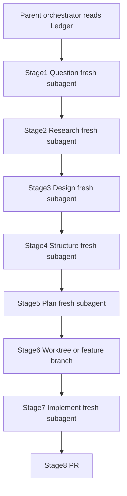

# Shadow AI Guardrail Gateway — Architecture & Roadmap

> ## THE LEDGER IS LAW
>
> This file is the **single source of truth** and the **binding constitution** for every
> agent, subagent, reviewer, and human working in this repository.
>
> - If an instruction conflicts with The Ledger, **The Ledger wins**.
> - If a model wants to "just quickly implement," **stop** and follow QRSPI + guardrails.
> - If a Human Hands-On checkpoint is open, agents **must not** fill it.
> - Read this file **before** any developmental cycle. Keep phase/checkpoint status current.

**Last updated:** 2026-07-20  
**Current phase:** Phase 1 — Crawl (Asynchronous Proxy Setup)  
**Checkpoint status:** `blocked_on_human` — Checkpoint #1 (`app/proxy/interceptor.py`)  
**Task workflow:** **QRSPI is mandatory** — see §5 and [`.cursor/qrspi/`](.cursor/qrspi/)

---

## 0. Mandatory Preflight for Every Agent

Before writing code or opening a PR, every parent agent MUST:

1. Read **this entire Ledger** (at least skim all numbered sections; fully read §§0–2, §5, §8).
2. Read [`.cursor/qrspi/README.md`](.cursor/qrspi/README.md), [`AUTONOMOUS_MODE.md`](.cursor/qrspi/AUTONOMOUS_MODE.md), and [`CONTEXT_ISOLATION.md`](.cursor/qrspi/CONTEXT_ISOLATION.md).
3. Run the **QRSPI workflow** for the task using **fresh subagents per stage** (no shared chat history across stages).
4. Pass each stage subagent **only** the artifact files allowed for that stage.
5. Answer every former "ask the human" QRSPI gate **autonomously** with best grounded judgment (see Autonomous Mode).
6. Never complete `TODO: Human Hands-On Implementation` blocks — those remain human-owned product checkpoints.

**Refusal rule:** An agent that skips QRSPI, merges stage contexts, or violates The Ledger is operating out of process. Stop and restart correctly.

---

## 1. Executive Context

We are building an **enterprise security proxy** that sits between corporate users and public LLMs (OpenAI / Anthropic) to prevent data leaks **pre-flight**. The gateway:

1. Intercepts outbound LLM traffic before it leaves the private network
2. Sanitizes prompts (Phase 2+) and enforces access rules
3. Tracks token consumption, errors, and risk metrics (Phase 3+)
4. Logs audit trails for compliance and operational risk management
5. Runs as a long-lived async service (Docker on Fly.io / Render / later AWS ECS) — **not** on Vercel serverless (streaming timeout risk)

### Human-in-the-Loop & Resume Constraint

This is a 12-month portfolio project. AI agents do ~90% of boilerplate and heavy lifting. The human Engineering Manager **must hands-on engineer the core logic of each pillar at least once or twice**, so every architectural choice and operational mechanism is resume-defensible.

By project end, the human must truthfully claim:

1. **Developed an asynchronous enterprise API proxy** handling outbound LLM traffic, reducing data-exposure risks by intercepting prompts pre-flight.
2. **Engineered a localized Python data-scrubbing pipeline** using NLP tokenization to automatically redact PII with sub-100ms latency.
3. **Integrated a PostgreSQL database layer** to securely track token consumption metrics, error tracking, and risk-management audit trails.
4. **Packaged application using Docker** and built infrastructure-as-code (Terraform) deployment pipelines to securely host the gateway within a private cloud network.

---

## 2. Agent Hierarchy (Chain of Command)

| Role | Model | When to invoke |
|------|-------|----------------|
| **THE BRAIN** | Opus 4.8 | Extremely sparingly. High-level architectural impasses only. Do **not** invoke unless explicitly told. |
| **SENIOR ENGINEER** | Grok 4.5 | Architect, workflow designer, reviewer. Directs building; not the primary bulk code doer. |
| **THE DOER / ACHIEVER** | Composer 2.5 / Auto 2.5 | Bulk file generation, boilerplate, configurations, baseline tests, refactoring. |
| **THE SECURITY CHIEF** | GPT-5.6 Sol | Extreme edge cases only: data scrubbing perfection, pre-flight tokenization, cryptographic verification, exhaustive security test coverage. |

**Default cycle:** Ledger preflight → QRSPI (isolated subagents, autonomous answers) → Composer implements plan → Grok reviews → Human fills product checkpoints → validation.

> QRSPI autonomy does **not** override Human Hands-On product checkpoints.

---

## 3. Four-Phase Timeline & Progression Audit

Status vocabulary: `not_started` | `in_progress` | `blocked_on_human` | `complete`

### Phase 1: The Crawl Phase (Months 1–3) — Asynchronous Proxy Setup

| Field | Value |
|-------|-------|
| **Status** | `in_progress` |
| **Checkpoint status** | `blocked_on_human` |
| **Checkpoint file** | `app/proxy/interceptor.py` |
| **Owner (checkpoint)** | Human |

**What we build:** A FastAPI Python service that accepts a text prompt, forwards it asynchronously to OpenAI or Anthropic, handles streaming responses, and passes the answer back.

**What the human learns:** Web requests, `async`/`await`, API routing, HTTP status codes, environment variables.

**Human checkpoint:** Intercepting the raw outbound client request payload **pre-flight** — implement `intercept_outbound_request(...)` before any upstream provider call.

**Phase 1 technical contract:**

| Item | Spec |
|------|------|
| Runtime | Python 3.12 |
| Framework | FastAPI + Uvicorn |
| HTTP client | `httpx` (async streaming) |
| Config | `pydantic-settings` via env |
| Health | `GET /health` |
| Proxy | `POST /v1/chat/completions` (stream + non-stream) |
| Providers | OpenAI + Anthropic (request or env default) |
| Hosting stubs | `Dockerfile`, `fly.toml`, `render.yaml`, `docker-compose.yml` |
| Out of scope | Scrubbing (Phase 2), DB (Phase 3), Terraform/AWS (Phase 4) |

**Env vars (Phase 1):**

- `OPENAI_API_KEY` — OpenAI upstream key
- `ANTHROPIC_API_KEY` — Anthropic upstream key
- `DEFAULT_PROVIDER` — `openai` \| `anthropic` (default: `openai`)
- `GATEWAY_HOST` / `GATEWAY_PORT` — bind address (default `0.0.0.0:8000`)
- `LOG_LEVEL` — logging verbosity

---

### Phase 2: The Walk Phase (Months 4–6) — Local AI & Data Manipulation

| Field | Value |
|-------|-------|
| **Status** | `not_started` |
| **Checkpoint status** | `not_started` |
| **Checkpoint file** | TBD — core string substitution / regex-NLP scrubbing loop |
| **Owner (checkpoint)** | Human |

**What we build:** Pre-forward inspection: string flags (API keys, credit cards) + lightweight local NLP (spaCy or high-performance regex) to redact names/corporate terms as tokens like `[REDACTED_NAME]`. **Latency budget: sub-100ms.**

**What the human learns:** Data scrubbing, string manipulation, tokenization, local text pipelines.

**Human checkpoint:** The core string substitution / regex-NLP scrubbing array loop.

---

### Phase 3: The Run Phase (Months 7–9) — Database & Audit Logs

| Field | Value |
|-------|-------|
| **Status** | `not_started` |
| **Checkpoint status** | `not_started` |
| **Checkpoint file** | TBD — SQL/ORM insert + analytics schema |
| **Owner (checkpoint)** | Human |

**What we build:** Supabase PostgreSQL. On every employee prompt, asynchronously log timestamp, user ID, token counts, and whether sensitive data leaks were intercepted.

**What the human learns:** SQL schemas, async connection pooling, data relationships, operational risk metrics.

**Human checkpoint:** Writing the raw SQL or ORM model insertion statement and constructing the analytics schema.

---

### Phase 4: The Cloud Phase (Months 10–12) — Infrastructure & DevOps

| Field | Value |
|-------|-------|
| **Status** | `not_started` |
| **Checkpoint status** | `not_started` |
| **Checkpoint file** | TBD — core `Dockerfile` polish + Terraform `main.tf` resources |
| **Owner (checkpoint)** | Human |

**What we build:** Production `Dockerfile` packaging + Terraform (`main.tf`) modeling the container in an AWS ECS / VPC private cloud network. (Phase 1 already ships staging stubs for Fly/Render.)

**What the human learns:** Containerization, cloud networking, private subnets, infrastructure-as-code.

**Human checkpoint:** Writing the core `Dockerfile` build instructions and defining the basic Terraform resources block.

---

## 4. Progression Audit Table

| Phase | Name | Checkpoint file | Checkpoint owner | Phase status | Checkpoint status |
|-------|------|-----------------|------------------|--------------|-------------------|
| 1 | Crawl — Async Proxy | `app/proxy/interceptor.py` | Human | `in_progress` | `blocked_on_human` |
| 2 | Walk — Scrubbing | TBD | Human | `not_started` | `not_started` |
| 3 | Run — Postgres Audit | TBD | Human | `not_started` | `not_started` |
| 4 | Cloud — Docker + Terraform | TBD | Human | `not_started` | `not_started` |

---

## 5. Operational Protocol — QRSPI Is Mandatory

### 5.1 Default developmental cycle

1. **Preflight** — Read The Ledger + `.cursor/qrspi/*` (§0).
2. **QRSPI** — Run stages 1→8 via isolated subagents (details below).
3. **Human product checkpoint** — If the work touches a `TODO: Human Hands-On Implementation` block, stop there; do not auto-complete it. Inject/keep cheat sheets.
4. **Validation** — After human fills a checkpoint (or after autonomous non-checkpoint work), run tests / latency / security checks as required by phase.

### 5.2 QRSPI workflow (law)

Canonical playbooks: [`.cursor/qrspi/`](.cursor/qrspi/)

| Stage | Playbook | Writes | Subagent inputs (ONLY) |
|-------|----------|--------|-------------------------|
| 1 Question | `1_question.md` | `task.md`, `questions.md` | Task / ticket + Ledger |
| 2 Research | `2_research.md` | `research.md` | **`questions.md` only** (never `task.md`) |
| 3 Design | `3_design.md` | `design.md` | `task.md`, `questions.md`, `research.md` |
| 4 Structure | `4_structure.md` | `structure.md` | `design.md`, `research.md` |
| 5 Plan | `5_plan.md` | `plan.md` | `structure.md`, `design.md`, `research.md` |
| 6 Worktree | `6_worktree.md` | isolated branch/worktree | artifact dir + `plan.md` |
| 7 Implement | `7_implement.md` | code + checked `plan.md` | **`plan.md` primary** |
| 8 PR | `8_pr.md` | PR | `design.md` + diff/commits |

Helper subagents (spawn inside stages as directed): [`.cursor/qrspi/agents/`](.cursor/qrspi/agents/)
(`codebase-locator`, `codebase-analyzer`, `codebase-pattern-finder`, `web-search-researcher`).

Artifacts live under `thoughts/qrspi/<YYYY-MM-DD-brief-description>/`.



### 5.3 Autonomous Mode (no QRSPI human gates)

See [`.cursor/qrspi/AUTONOMOUS_MODE.md`](.cursor/qrspi/AUTONOMOUS_MODE.md).

- Original QRSPI "wait for user / approve design" steps are **disabled**.
- The stage agent must still enumerate design options, then **pick the best answer** and record rationale (`## Autonomous Decisions` / `## Autonomous Assumptions`).
- Proceed without blocking on humans.
- **Exception:** Human Hands-On **product** checkpoints remain blocked for agents. QRSPI autonomy ≠ permission to implement those TODOs.

### 5.4 Context isolation (non-negotiable)

See [`.cursor/qrspi/CONTEXT_ISOLATION.md`](.cursor/qrspi/CONTEXT_ISOLATION.md).

- **Fresh subagent per QRSPI stage** — do not `resume` a prior stage agent for a later stage.
- **No shared chat history** across stages — disk artifacts are the only bridge.
- **File allowlists** — pass only the inputs in §5.2; Research must never see `task.md`.
- **Anti-pattern ban:** one mega-agent doing Question→Implement in a single context.

### 5.5 Agent hierarchy inside QRSPI

| Role | Model | QRSPI usage |
|------|-------|-------------|
| THE BRAIN | Opus 4.8 | Only on explicit architectural impasse — not routine QRSPI |
| SENIOR ENGINEER | Grok 4.5 | Orchestrates QRSPI, reviews artifacts, enforces Ledger |
| THE DOER | Composer / Auto 2.5 | Stage 7 implement + boilerplate inside plan bounds |
| SECURITY CHIEF | GPT-5.6 Sol | Extreme security/crypto edge cases only |

Orchestrators should spawn QRSPI stage runners as general-purpose / explore subagents with the playbook + allowlisted files pasted into the prompt.

### 5.6 Learning checkpoints (product, not QRSPI)

Separately from QRSPI gates, before a core pillar feature is auto-completed:

1. Inject `TODO: Human Hands-On Implementation`
2. Provide a 3-bullet cheat sheet
3. Leave `NotImplementedError` (or equivalent) until the human implements
4. Validate after human completion

---

## 6. Human Checkpoint #1 (Active)

**File:** `app/proxy/interceptor.py`  
**Function:** `intercept_outbound_request(...)`  
**Status:** `blocked_on_human`

### Cheat sheet (why this works)

1. **Pre-flight** means inspect/normalize the outbound payload **before** any bytes hit OpenAI/Anthropic — this is the choke point for later scrubbing and audit.
2. **`async def`** keeps the event loop free to serve other requests while awaiting I/O; the gateway must not block on a single upstream call.
3. Return a **normalized internal request** that provider adapters can stream against; raise `HTTPException(4xx)` on invalid input and never call providers on bad payloads.

### Scope rules for Checkpoint #1

- DO: validate required fields (`model`, `messages`), attach `correlation_id` / `received_at`, return the upstream-ready payload.
- DO NOT: implement scrubbing (Phase 2).
- DO NOT: write DB inserts (Phase 3).
- DO NOT: have agents silently complete this function — leave `NotImplementedError` until the human fills it.

**Call site:** `app/api/v1/chat.py` must always invoke `intercept_outbound_request` before provider streaming.

---

## 7. Target Repository Layout (Phase 1)

```text
/
├── architecture_and_roadmap.md          # THIS FILE — The Ledger (LAW)
├── .cursor/
│   └── qrspi/                           # Mandatory QRSPI playbooks
│       ├── README.md
│       ├── AUTONOMOUS_MODE.md
│       ├── CONTEXT_ISOLATION.md
│       ├── 1_question.md … 8_pr.md
│       └── agents/                      # locator / analyzer / pattern / web
├── thoughts/
│   └── qrspi/                           # Per-task QRSPI artifacts
├── README.md
├── .env.example
├── .gitignore
├── pyproject.toml
├── Dockerfile
├── fly.toml
├── render.yaml
├── docker-compose.yml
├── app/
│   ├── __init__.py
│   ├── main.py
│   ├── config.py
│   ├── api/
│   │   ├── __init__.py
│   │   ├── health.py
│   │   └── v1/
│   │       ├── __init__.py
│   │       └── chat.py
│   ├── proxy/
│   │   ├── __init__.py
│   │   ├── interceptor.py               # ★ HUMAN CHECKPOINT #1
│   │   ├── providers/
│   │   │   ├── __init__.py
│   │   │   ├── base.py
│   │   │   ├── openai.py
│   │   │   └── anthropic.py
│   │   └── streaming.py
│   └── models/
│       ├── __init__.py
│       └── schemas.py
└── tests/
    ├── test_health.py
    ├── test_interceptor_contract.py
    └── test_proxy_routing.py
```

---

## 8. Non-Negotiable Guardrails

1. **The Ledger is law** — conflicting agent instincts lose; update The Ledger deliberately when process changes.
2. **QRSPI is mandatory** for developmental tasks — playbooks under `.cursor/qrspi/`; artifacts under `thoughts/qrspi/`.
3. **Fresh subagent per QRSPI stage** — no shared chat history; file allowlists only; Research never reads `task.md`.
4. **Autonomous QRSPI gates** — agents answer design/plan questions themselves; do not block on humans for QRSPI approvals.
5. **Never auto-complete human product checkpoint blocks** — scaffold + cheat sheet only.
6. **No Vercel for the streaming proxy** — Docker on Fly.io, Render, or (Phase 4) AWS ECS.
7. **Sub-100ms scrub budget** from Phase 2 onward — measure and enforce with validation scripts.
8. **Secrets only via environment variables** — never commit API keys or `.env` files.
9. **The Ledger stays current** — update phase/checkpoint status whenever status changes.
10. **Supabase PostgreSQL** is the production database target (Phase 3); do not invent a parallel primary store.
11. **Bugbot** findings are first-class work items.
12. **Opus 4.8 and GPT-5.6 Sol** are restricted roles — do not invoke without explicit instruction.

---

## 9. Resume Defense Map

| Resume claim | Phase | Human-owned artifact |
|--------------|-------|----------------------|
| Async enterprise API proxy / pre-flight intercept | 1 | `app/proxy/interceptor.py` |
| Localized PII scrubbing pipeline (&lt;100ms) | 2 | Scrubbing loop (TBD path) |
| PostgreSQL metrics & audit trails | 3 | Schema + insert path (TBD) |
| Docker + Terraform private cloud hosting | 4 | `Dockerfile` + `main.tf` (TBD) |

---

## 10. Change Log

| Date | Change | Author |
|------|--------|--------|
| 2026-07-20 | Mandated QRSPI for all agents; installed `.cursor/qrspi/` playbooks; Autonomous Mode (no human QRSPI gates); Context Isolation law; Ledger elevated to constitution | Senior Engineer (Grok 4.5) |
| 2026-07-19 | Initial Ledger created; Phase 1 scaffold kicked off; Checkpoint #1 armed | Senior Engineer (Grok 4.5) |
