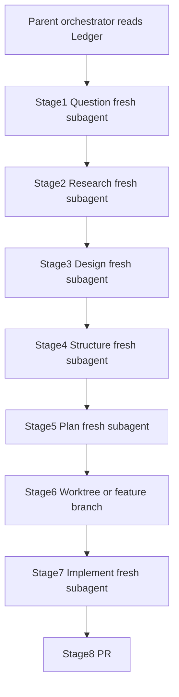

# Shadow AI Guardrail Gateway — Architecture & Roadmap

> ## THE LEDGER IS LAW
>
> This file is the **single source of truth** and the **binding constitution** for every
> agent, subagent, reviewer, and human working in this repository.
>
> - If an instruction conflicts with The Ledger, **The Ledger wins**.
> - If a model wants to "just quickly implement," **stop** and follow QRSPI + guardrails.
> - If a Human Hands-On checkpoint is open, agents **must not** fill it.
> - Read this file **before** any developmental cycle. Keep phase/checkpoint status current.

**Last updated:** 2026-07-20  
**Current phase:** Phase 1 — Crawl (Asynchronous Proxy Setup)  
**Checkpoint status:** `blocked_on_human` — Checkpoint #1 (`app/proxy/interceptor.py`)  
**Pre-merge gate:** AI Governance Engine (Steps 1–7) — `in_progress` (required check on `main`)  
**Task workflow:** **QRSPI is mandatory** — see §5 and [`.cursor/qrspi/`](.cursor/qrspi/)

---

## 0. Pre-Merge Gate — AI Governance Engine (Steps 1–7)

> **Why this exists:** Vercel + Bugbot alone do **not** enforce AST structure, OWASP patterns,
> fuzzing, Big-O, copyright, or that **you understand the change**. This suite is the merge gate.

### What ships the gate

| Piece | Path | Role |
|-------|------|------|
| Steps 1–6 CLI | `governance/` | Local + CI analysis suite (`ai-guardrail`) |
| CI workflow | `.github/workflows/ai-guardrail.yml` | Runs on every PR → `main` (check name: **Governance Steps 1–6**) |
| Step 6 Comprehension | `governance/.../comprehension_gate.py` | Beginner study guide + quiz |
| Step 7 dashboard | `dashboard/` | Human quiz + Approve/Merge via GitHub API |
| Signature DB | `governance/governance/signatures/known_snippets.json` | Copyright fingerprints |

### The seven steps

| # | Name | Blocks merge? |
|---|------|---------------|
| 1 | AST Guardrail | Yes (error/critical) — **in Actions** |
| 2 | Security Auditor | Yes (error/critical) — **in Actions** |
| 3 | Fuzz Chamber | Yes (crashes) — **in Actions** |
| 4 | Benchmark Engine | Informational — **in Actions** |
| 5 | Copyright Filter | Yes (high similarity) — **in Actions** |
| 6 | **Comprehension Gate** | Quiz **generated** in Actions; **human pass (≥80%) on dashboard / local CLI** before Approve & Merge |
| 7 | Human Review Panel | Dashboard approve/merge (after quiz) |

### How Step 6 (comprehension) is tracked

**GitHub Actions does not grade you.** The `Governance Steps 1–6` check:

1. Runs automated analysis (Steps 1–5)
2. **Generates** the study guide + quiz for this PR’s diff (Step 6)
3. Comments the report on the PR
4. Goes ✅ green if generation succeeded and there are no blocking findings

**You prove understanding separately:**

| Where | Command / action |
|-------|------------------|
| Local practice | `cd governance && ai-guardrail quiz --root .. --skip-llm` |
| Dashboard (Step 7) | Deploy `dashboard/`, open it after CI POSTs the report → read guide → submit quiz (≥80%) → Approve & Merge unlocks |

Until the dashboard is deployed (`GOVERNANCE_DASHBOARD_URL` + secrets), practice with the local `quiz` command. Branch protection still requires the Actions check to be green.

### Agent preflight (before coding)

1. Read this Ledger (§§0–2, §5, §8 at minimum).
2. Read [`.cursor/qrspi/README.md`](.cursor/qrspi/README.md), [`AUTONOMOUS_MODE.md`](.cursor/qrspi/AUTONOMOUS_MODE.md), [`CONTEXT_ISOLATION.md`](.cursor/qrspi/CONTEXT_ISOLATION.md).
3. Run **QRSPI** with **fresh subagents per stage** and file allowlists.
4. Never complete `TODO: Human Hands-On Implementation` blocks.
### Required human setup (for the gate to actually protect `main`)

See **§11 Setup Checklist** below. Require status checks:

- **`Governance Steps 1–6`**
- **`Enterprise Layers B–E`** (Dependabot/gitleaks/ruff/mypy/semgrep/tests/trivy/checkov — see [`ENTERPRISE_LAYERS.md`](ENTERPRISE_LAYERS.md))
- **`CodeQL (Layer C)`** after it appears once

Protect Main ruleset now requires those three checks + Code Owner review + dismiss stale reviews. Remaining operator steps (secret push protection, signed commits, second reviewer, etc.) are listed in [`ENTERPRISE_LAYERS.md`](ENTERPRISE_LAYERS.md).

---

## 0b. Enterprise Layers B–E (additive)

| Layer | Focus | Automations in repo |
|-------|-------|---------------------|
| B | Supply chain & secrets | Dependabot, checksummed Gitleaks, pip-audit, npm audit (high+ hard-fail) |
| C | Static analysis | Ruff, Mypy, Semgrep (custom + ERROR packs), CodeQL Advanced (`codeql.yml`, security-extended upload), CODEOWNERS |
| D | Product tests | API integration tests, egress/audit contracts, coverage ≥60% |
| E | Ship & runtime | `EgressCheckedAsyncClient`, audit DDL, non-root Docker→Trivy CRITICAL+HIGH + SBOM, Terraform+Checkov |

Details: [`ENTERPRISE_LAYERS.md`](ENTERPRISE_LAYERS.md).

---

## 1. Executive Context

We are building an **enterprise security proxy** that sits between corporate users and public LLMs (OpenAI / Anthropic) to prevent data leaks **pre-flight**. The gateway:

1. Intercepts outbound LLM traffic before it leaves the private network
2. Sanitizes prompts (Phase 2+) and enforces access rules
3. Tracks token consumption, errors, and risk metrics (Phase 3+)
4. Logs audit trails for compliance and operational risk management
5. Runs as a long-lived async service (Docker on Fly.io / Render / later AWS ECS) — **not** on Vercel serverless (streaming timeout risk)

### Human-in-the-Loop & Resume Constraint

This is a 12-month portfolio project. AI agents do ~90% of boilerplate and heavy lifting. The human Engineering Manager **must hands-on engineer the core logic of each pillar at least once or twice**, so every architectural choice and operational mechanism is resume-defensible.

By project end, the human must truthfully claim:

1. **Developed an asynchronous enterprise API proxy** handling outbound LLM traffic, reducing data-exposure risks by intercepting prompts pre-flight.
2. **Engineered a localized Python data-scrubbing pipeline** using NLP tokenization to automatically redact PII with sub-100ms latency.
3. **Integrated a PostgreSQL database layer** to securely track token consumption metrics, error tracking, and risk-management audit trails.
4. **Packaged application using Docker** and built infrastructure-as-code (Terraform) deployment pipelines to securely host the gateway within a private cloud network.

---

## 2. Agent Hierarchy (Chain of Command)

| Role | Model | When to invoke |
|------|-------|----------------|
| **THE BRAIN** | Opus 4.8 | Extremely sparingly. High-level architectural impasses only. Do **not** invoke unless explicitly told. |
| **SENIOR ENGINEER** | Grok 4.5 | Architect, workflow designer, reviewer. Directs building; not the primary bulk code doer. |
| **THE DOER / ACHIEVER** | Composer 2.5 / Auto 2.5 | Bulk file generation, boilerplate, configurations, baseline tests, refactoring. |
| **THE SECURITY CHIEF** | GPT-5.6 Sol | Extreme edge cases only: data scrubbing perfection, pre-flight tokenization, cryptographic verification, exhaustive security test coverage. |

**Default cycle:** Ledger preflight → QRSPI (isolated subagents, autonomous answers) → Composer implements plan → Grok reviews → Human fills product checkpoints → governance validation.

> QRSPI autonomy does **not** override Human Hands-On product checkpoints.

---

## 3. Four-Phase Timeline & Progression Audit

Status vocabulary: `not_started` | `in_progress` | `blocked_on_human` | `complete`

### Phase 1: The Crawl Phase (Months 1–3) — Asynchronous Proxy Setup

| Field | Value |
|-------|-------|
| **Status** | `in_progress` |
| **Checkpoint status** | `blocked_on_human` |
| **Checkpoint file** | `app/proxy/interceptor.py` |
| **Owner (checkpoint)** | Human |

**What we build:** A FastAPI Python service that accepts a text prompt, forwards it asynchronously to OpenAI or Anthropic, handles streaming responses, and passes the answer back.

**What the human learns:** Web requests, `async`/`await`, API routing, HTTP status codes, environment variables.

**Human checkpoint:** Intercepting the raw outbound client request payload **pre-flight** — implement `intercept_outbound_request(...)` before any upstream provider call.

**Phase 1 technical contract:**

| Item | Spec |
|------|------|
| Runtime | Python 3.12 |
| Framework | FastAPI + Uvicorn |
| HTTP client | `httpx` (async streaming) |
| Config | `pydantic-settings` via env |
| Health | `GET /health` |
| Proxy | `POST /v1/chat/completions` (stream + non-stream) |
| Providers | OpenAI + Anthropic (request or env default) |
| Hosting stubs | `Dockerfile`, `fly.toml`, `render.yaml`, `docker-compose.yml` |
| Out of scope | Scrubbing (Phase 2), DB (Phase 3), Terraform/AWS (Phase 4) |

**Env vars (Phase 1):**

- `OPENAI_API_KEY` — OpenAI upstream key
- `ANTHROPIC_API_KEY` — Anthropic upstream key
- `DEFAULT_PROVIDER` — `openai` \| `anthropic` (default: `openai`)
- `GATEWAY_HOST` / `GATEWAY_PORT` — bind address (default `0.0.0.0:8000`)
- `LOG_LEVEL` — logging verbosity

---

### Phase 2: The Walk Phase (Months 4–6) — Local AI & Data Manipulation

| Field | Value |
|-------|-------|
| **Status** | `not_started` |
| **Checkpoint status** | `not_started` |
| **Checkpoint file** | TBD — core string substitution / regex-NLP scrubbing loop |
| **Owner (checkpoint)** | Human |

**What we build:** Pre-forward inspection: string flags (API keys, credit cards) + lightweight local NLP (spaCy or high-performance regex) to redact names/corporate terms as tokens like `[REDACTED_NAME]`. **Latency budget: sub-100ms.**

**What the human learns:** Data scrubbing, string manipulation, tokenization, local text pipelines.

**Human checkpoint:** The core string substitution / regex-NLP scrubbing array loop.

---

### Phase 3: The Run Phase (Months 7–9) — Database & Audit Logs

| Field | Value |
|-------|-------|
| **Status** | `not_started` |
| **Checkpoint status** | `not_started` |
| **Checkpoint file** | TBD — SQL/ORM insert + analytics schema |
| **Owner (checkpoint)** | Human |

**What we build:** Supabase PostgreSQL. On every employee prompt, asynchronously log timestamp, user ID, token counts, and whether sensitive data leaks were intercepted.

**What the human learns:** SQL schemas, async connection pooling, data relationships, operational risk metrics.

**Human checkpoint:** Writing the raw SQL or ORM model insertion statement and constructing the analytics schema.

---

### Phase 4: The Cloud Phase (Months 10–12) — Infrastructure & DevOps

| Field | Value |
|-------|-------|
| **Status** | `not_started` |
| **Checkpoint status** | `not_started` |
| **Checkpoint file** | TBD — core `Dockerfile` polish + Terraform `main.tf` resources |
| **Owner (checkpoint)** | Human |

**What we build:** Production `Dockerfile` packaging + Terraform (`main.tf`) modeling the container in an AWS ECS / VPC private cloud network. (Phase 1 already ships staging stubs for Fly/Render.)

**What the human learns:** Containerization, cloud networking, private subnets, infrastructure-as-code.

**Human checkpoint:** Writing the core `Dockerfile` build instructions and defining the basic Terraform resources block.

---

## 4. Progression Audit Table

| Phase | Name | Checkpoint file | Checkpoint owner | Phase status | Checkpoint status |
|-------|------|-----------------|------------------|--------------|-------------------|
| 1 | Crawl — Async Proxy | `app/proxy/interceptor.py` | Human | `in_progress` | `blocked_on_human` |
| 2 | Walk — Scrubbing | TBD | Human | `not_started` | `not_started` |
| 3 | Run — Postgres Audit | TBD | Human | `not_started` | `not_started` |
| 4 | Cloud — Docker + Terraform | TBD | Human | `not_started` | `not_started` |

---

## 5. Operational Protocol — QRSPI Is Mandatory

### 5.1 Default developmental cycle

1. **Preflight** — Read The Ledger + `.cursor/qrspi/*` (§0).
2. **QRSPI** — Run stages 1→8 via isolated subagents (details below).
3. **Human product checkpoint** — If the work touches a `TODO: Human Hands-On Implementation` block, stop there; do not auto-complete it. Inject/keep cheat sheets.
4. **Governance** — Run `ai-guardrail` locally; CI must stay green; pass comprehension quiz before dashboard merge.
5. **Validation** — After human fills a checkpoint, run tests / latency / security checks as required by phase.

### 5.2 QRSPI workflow (law)

Canonical playbooks: [`.cursor/qrspi/`](.cursor/qrspi/)

| Stage | Playbook | Writes | Subagent inputs (ONLY) |
|-------|----------|--------|-------------------------|
| 1 Question | `1_question.md` | `task.md`, `questions.md` | Task / ticket + Ledger |
| 2 Research | `2_research.md` | `research.md` | **`questions.md` only** (never `task.md`) |
| 3 Design | `3_design.md` | `design.md` | `task.md`, `questions.md`, `research.md` |
| 4 Structure | `4_structure.md` | `structure.md` | `design.md`, `research.md` |
| 5 Plan | `5_plan.md` | `plan.md` | `structure.md`, `design.md`, `research.md` |
| 6 Worktree | `6_worktree.md` | isolated branch/worktree | artifact dir + `plan.md` |
| 7 Implement | `7_implement.md` | code + checked `plan.md` | **`plan.md` primary** |
| 8 PR | `8_pr.md` | PR | `design.md` + diff/commits |

Helper subagents: [`.cursor/qrspi/agents/`](.cursor/qrspi/agents/)

Artifacts live under `thoughts/qrspi/<YYYY-MM-DD-brief-description>/`.



### 5.3 Autonomous Mode (no QRSPI human gates)

See [`.cursor/qrspi/AUTONOMOUS_MODE.md`](.cursor/qrspi/AUTONOMOUS_MODE.md).

- Original QRSPI "wait for user / approve design" steps are **disabled**.
- The stage agent must still enumerate design options, then **pick the best answer** and record rationale.
- **Exception:** Human Hands-On **product** checkpoints remain blocked for agents.

### 5.4 Context isolation (non-negotiable)

See [`.cursor/qrspi/CONTEXT_ISOLATION.md`](.cursor/qrspi/CONTEXT_ISOLATION.md).

- **Fresh subagent per QRSPI stage** — do not `resume` a prior stage agent for a later stage.
- **No shared chat history** across stages — disk artifacts are the only bridge.
- **File allowlists** — Research must never see `task.md`.

### 5.5 Learning checkpoints (product, not QRSPI)

Separately from QRSPI gates, before a core pillar feature is auto-completed:

1. Inject `TODO: Human Hands-On Implementation`
2. Provide a 3-bullet cheat sheet
3. Leave `NotImplementedError` (or equivalent) until the human implements
4. Validate after human completion

---

## 6. Human Checkpoint #1 (Active)

**File:** `app/proxy/interceptor.py`  
**Function:** `intercept_outbound_request(...)`  
**Status:** `blocked_on_human`

### Cheat sheet (why this works)

1. **Pre-flight** means inspect/normalize the outbound payload **before** any bytes hit OpenAI/Anthropic — this is the choke point for later scrubbing and audit.
2. **`async def`** keeps the event loop free to serve other requests while awaiting I/O; the gateway must not block on a single upstream call.
3. Return a **normalized internal request** that provider adapters can stream against; raise `HTTPException(4xx)` on invalid input and never call providers on bad payloads.

### Scope rules for Checkpoint #1

- DO: validate required fields (`model`, `messages`), attach `correlation_id` / `received_at`, return the upstream-ready payload.
- DO NOT: implement scrubbing (Phase 2).
- DO NOT: write DB inserts (Phase 3).
- DO NOT: have agents silently complete this function — leave `NotImplementedError` until the human fills it.

**Call site:** `app/api/v1/chat.py` must always invoke `intercept_outbound_request` before provider streaming.

---

## 7. Target Repository Layout

```text
/
├── architecture_and_roadmap.md          # THIS FILE — The Ledger
├── README.md
├── SETUP_GOVERNANCE.md
├── .cursor/qrspi/                       # Mandatory QRSPI playbooks
├── thoughts/qrspi/                      # Per-task QRSPI artifacts
├── .env.example
├── .gitignore
├── pyproject.toml                       # Gateway (Phase 1+)
├── Dockerfile
├── fly.toml
├── render.yaml
├── docker-compose.yml
├── .github/workflows/
│   ├── ai-guardrail.yml                 # Pre-merge governance CI
│   └── enterprise-hygiene.yml           # Layers B–E (supply chain → ship)
├── .github/dependabot.yml               # Layer B
├── .github/CODEOWNERS                   # Layer C
├── app/                                 # Gateway service
│   ├── main.py
│   ├── config.py
│   ├── api/...
│   ├── proxy/
│   │   ├── interceptor.py               # ★ HUMAN CHECKPOINT #1
│   │   └── providers/...
│   ├── security/                        # Layer E egress + audit scaffold
│   └── models/...
├── infra/terraform/                     # Layer E IaC stub (+ Checkov)
├── tests/                               # Gateway tests (Layer D)
├── governance/                          # Steps 1–6 (Python CLI)
│   ├── pyproject.toml
│   ├── README.md
│   ├── governance/
│   │   ├── cli.py
│   │   ├── pipeline.py
│   │   ├── models.py
│   │   ├── reporters/
│   │   ├── signatures/known_snippets.json
│   │   └── steps/
│   │       ├── ast_guardrail.py         # Step 1
│   │       ├── security_auditor.py      # Step 2
│   │       ├── fuzz_chamber.py          # Step 3
│   │       ├── benchmark_engine.py      # Step 4
│   │       ├── copyright_filter.py      # Step 5
│   │       └── comprehension_gate.py    # Step 6 (quiz)
│   └── tests/
└── dashboard/                           # Step 7 (Next.js review panel)
    ├── package.json
    ├── README.md
    └── src/app/...
```

---

## 8. Non-Negotiable Guardrails

1. **No Vercel for the streaming proxy** — use Docker on Fly.io, Render, or (Phase 4) AWS ECS for long-lived async streaming.
2. **QRSPI is mandatory** for developmental tasks — playbooks under `.cursor/qrspi/`; artifacts under `thoughts/qrspi/`.
3. **Fresh subagent per QRSPI stage** — no shared chat history; file allowlists only; Research never reads `task.md`.
4. **Autonomous QRSPI gates** — agents answer design/plan questions themselves; do not block on humans for QRSPI approvals.
5. **Sub-100ms scrub budget** applies from Phase 2 onward; measure and enforce with validation scripts.
6. **Never auto-complete human checkpoint blocks** — agents scaffold, document, and test contracts only.
7. **Secrets only via environment variables** — never commit API keys or `.env` files.
8. **The Ledger stays current** — update phase/checkpoint status in this file whenever status changes.
9. **Supabase PostgreSQL** is the production database target (Phase 3); do not invent a parallel primary store.
10. **Bugbot** findings are first-class work items.
11. **Opus 4.8 and GPT-5.6 Sol** are restricted roles — do not invoke without explicit instruction.
12. **No merge to `main` without the `Governance Steps 1–6` check** (§11). Agents must not disable the workflow.
13. **Dashboard may use Vercel; the streaming gateway may not.**
14. **Comprehension quiz must be passed** (dashboard or local practice + honest understanding) before treating a PR as human-reviewed.

---

## 9. Resume Defense Map

| Resume claim | Phase | Human-owned artifact |
|--------------|-------|----------------------|
| Async enterprise API proxy / pre-flight intercept | 1 | `app/proxy/interceptor.py` |
| Localized PII scrubbing pipeline (&lt;100ms) | 2 | Scrubbing loop (TBD path) |
| PostgreSQL metrics & audit trails | 3 | Schema + insert path (TBD) |
| Docker + Terraform private cloud hosting | 4 | `Dockerfile` + `infra/terraform/main.tf` (stub landed; expand in Phase 4) |
| Egress allowlist / audit trail readiness | 1→3 | `app/security/egress.py`, `app/security/audit.py` |

---

## 10. Change Log

| Date | Change | Author |
|------|--------|--------|
| 2026-07-19 | Initial Ledger created; Phase 1 scaffold kicked off; Checkpoint #1 armed | Senior Engineer (Grok 4.5) |
| 2026-07-20 | Added §0 Pre-Merge Gate; scaffolded Steps 1–6 (`governance/`, CI workflow, `dashboard/`); §11 setup checklist | Senior Engineer (Grok 4.5) |
| 2026-07-20 | Inserted Step 6 Comprehension Gate (beginner quiz); human review panel becomes Step 7; merge locked until ≥80% | Senior Engineer (Grok 4.5) |
| 2026-07-20 | Landed Enterprise Layers B–E (Dependabot, Gitleaks, Ruff/Mypy/Semgrep/CodeQL, coverage floor, egress/audit, Trivy, Terraform+Checkov) | Senior Engineer (Grok 4.5) |
| 2026-07-20 | Hardened Layers B–E: SHA-pinned Actions, checksummed Gitleaks, Semgrep packs hard-fail, Trivy CRITICAL+HIGH + SBOM, CodeQL upload, `EgressCheckedAsyncClient`, non-root image, coverage ≥60% | Senior Engineer (Grok 4.5) |
| 2026-07-20 | Operator: Dependabot + Code scanning enabled; Protect Main tightened (strict checks, last-push approval, signed commits); CodeQL `upload: true` | Human + Senior Engineer |
| 2026-07-20 | Advanced Code scanning: tuned `codeql.yml` (`security-extended`, `CodeQL (Layer C)` check name, SARIF upload); removed duplicate CodeQL job from hygiene workflow | Senior Engineer (Grok 4.5) |

---

## 11. Setup Checklist — Make the Governance Gate Enforceable

Without these steps, the suite runs in CI but GitHub will still allow merges on green Vercel/Bugbot alone.

### A. Repository secrets & variables (GitHub → Settings → Secrets)

| Secret / Var | Required? | Purpose |
|--------------|-----------|---------|
| _(none for core Steps 1,3,4,5)_ | — | Deterministic checks need no secrets |
| `OPENAI_API_KEY` or `GOVERNANCE_LLM_API_KEY` | Optional | Enables Step 2 LLM OWASP review of the PR diff |
| `GOVERNANCE_DASHBOARD_URL` | Optional until dashboard is live | e.g. `https://your-dashboard.vercel.app` |
| `GOVERNANCE_DASHBOARD_SECRET` | Required if dashboard URL set | Must match dashboard env |
| `GOVERNANCE_LLM_MODEL` (variable) | Optional | Defaults to `gpt-4o-mini` |

`GITHUB_TOKEN` is provided automatically by Actions for PR comments.

### B. Branch protection on `main` (critical)

Prefer the **Protect Main** ruleset (already active). It requires:

1. Pull request before merging
2. Status checks: **`Governance Steps 1–6`**, **`Enterprise Layers B–E`**, **`CodeQL (Layer C)`**
3. **Require review from Code Owners**
4. **Dismiss stale reviews** on new pushes
5. **Require approval of the most recent reviewable push**
6. **Branches up to date** before merging
7. **Signed commits**
8. CodeQL code-scanning gate + Preview deployment

Still optional (see [`ENTERPRISE_LAYERS.md`](ENTERPRISE_LAYERS.md)): secret scanning + push protection (confirm on), second CODEOWNER when you have a teammate, governance dashboard deploy. **Dependabot alerts/security updates** and **Code scanning** are enabled.

**Also enforce comprehension in practice:** even with CI green, use the dashboard’s Step 6 quiz before merge — Approve & Merge stays locked until you pass (≥80%).

### C. Deploy the Step 7 dashboard (Vercel)

The quiz UI lives in `dashboard/`. Deploy it as a **new** Vercel project with
**Root Directory = `dashboard`** (do not reuse unrelated sellable-saas projects).

On Vercel you **must** attach **Upstash Redis** (Marketplace → Storage) so quiz
state survives across serverless invocations. Set:

| Env | Where |
|-----|-------|
| `GOVERNANCE_DASHBOARD_SECRET` | Vercel + matching GitHub Actions secret |
| `UPSTASH_REDIS_REST_URL` / `UPSTASH_REDIS_REST_TOKEN` | Auto from Upstash Marketplace |
| `GOVERNANCE_DASHBOARD_URL` | GitHub Actions secret → your `https://….vercel.app` |
| `GITHUB_TOKEN` / `GH_MERGE_TOKEN` | Vercel only — fine-grained PAT with `contents: write` + `pull-requests: write` for Approve & Merge |

Click-path checklist: [`SETUP_GOVERNANCE.md`](SETUP_GOVERNANCE.md) §4.

Local dry-run: `cd dashboard && npm install && npm run dev`.

### D. Local dry-run before pushing

```bash
cd governance && pip install -e ".[dev]" && pytest
ai-guardrail run --root .. --skip-llm
ai-guardrail quiz --root .. --skip-llm   # practice Step 6 locally
```

### E. What you still do manually (resume-defensible CS)

The suite is implemented end-to-end so CI works Day 1. Deepen ownership by extending:

1. **AST** — add project-specific forbidden patterns (e.g. disallow sync `httpx` in `app/`)
2. **Fuzz** — target real gateway helpers once Checkpoint #1 lands
3. **Benchmark** — wire per-PR function injection instead of calibration profiles only
4. **Copyright** — grow `known_snippets.json` with frameworks you must not paste
5. **Comprehension** — add domain questions as you learn new phases (scrubbing, SQL, Terraform)
6. **Dashboard** — swap `.data/reviews.json` for Supabase when Phase 3 starts

### F. Relationship to Bugbot & Vercel

| Check | What it catches | What it misses |
|-------|-----------------|----------------|
| Vercel | Dashboard deploy health | Gateway streaming safety, AST, OWASP, fuzz, understanding |
| Bugbot | Reviewer-style code critique | Deterministic policy + forcing *you* to understand |
| **AI Guardrail** | Structural / security / fuzz / copyright / **comprehension quiz** | Product UX polish of the dashboard |
